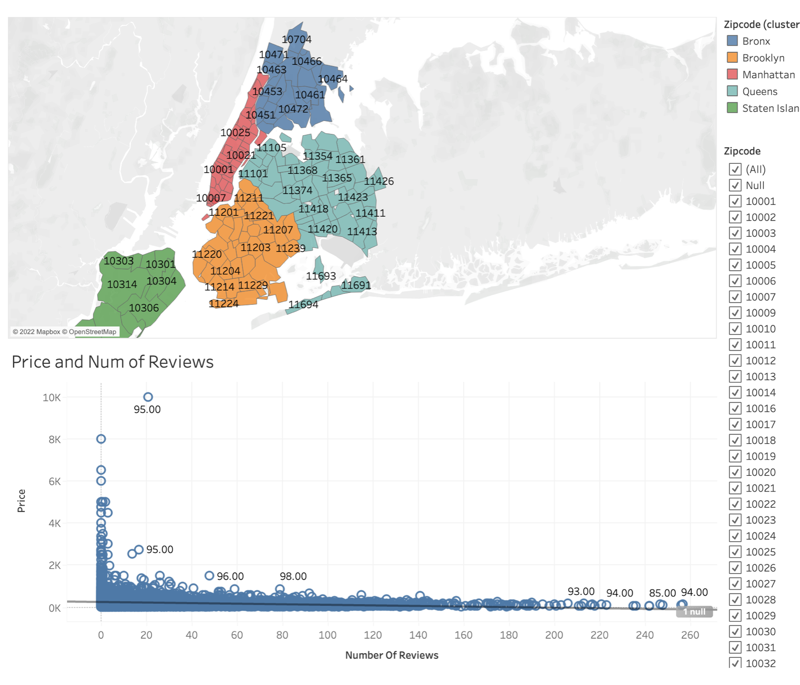

# Final-Project-Tableau

## Project/Goals
* Understand Airbnb's New York City (NYC)'s short-term home market
* Perform exploratory data analysis to understand the relationship and trends * of Airbnb's short-term homestay market in NYC.
* Create visualizations and dashboards to illustrate findings and to answer questions of concern.

## Process
1. Loaded the data from Airbnb's New York City's public data (2008 to 2015) 
2. Cleaned data (duplicates, outliers)
3. Explored data using visualizations (looked for trends)
4. Formed questions and investigate data 
5. Created interactive dashboards in Tableau

## Results

I selected the Airbnb dataset (2008 to 2015) for this project. 
Visualizations created for the Airbnb dataset of 2008 to 2015:

1. Number of listings and the room type per neighbourhood

**Summary**: Manhattan and Brooklyn have the most listings compared to the other neighbourhoods. This could be due to a high popularity of tourism in the area.

2. Average Price per Bed by Room Type

Summary: The average price of a bed increased with the space of the room provided (e.g. the entire home). Also, Manhattan has the most expensive room types compared to the other boroughs. Lastly, the average price of a bed for an entire home is seen to be the most expensive in all neighbourhoods. 

3. Zipcode and Average rating score 

**Summary**: The average rating score per zipcode are overall good with most of the zipcodes above 85% rating. Also, some scores may have been affected by the number of reviews. For example, if there were only 10 reviews, but the score was 100, it would be important to investigate that data point as oppose to over 100 reviews and a high score of 95.

4. Average price vs. Number of listings by room type

**Summary**: There is an average price of listings increase for every neighbourhood in New York City until 2012. After 2012, there was a sharp decline in average price for each neighbourhood per year. This sharp decline in price may have been due to the increase of listings in 2012 (hence more competition). Between 2014 and 2015, there is a steep decline in average price of listings. This may be due to the mixture of competition, as well as the increased regulation laws in NYC, forcing Airbnb to remove over 1500 listings from the public data released. The data here may not be as representative for each neighbourhood.

5. Forecast the number of listings by neighbourhood

**Summary**: The number of listed hosts have increased from 2008 to 2015, with Manhattan and Brooklyn having the most number of increase in listings per host compared to other boroughs like Queens, Staten Island, and Bronx. With forecast analysis, Manhattan and Queens are both projected to increase in the number of listings by ~10% from 2016 to 2017. 

## Questions asked based on the analyses above:

1. What is the median price for each room type in a particular neighbourhood?

Refer to interactive dashboard 1 in Tableau

2. What are the room types in a particular zipcode and their respective prices and rating score?

Refer to interactive dashboard 2 in Tableau

3. Which zipcodes have the highest ratings (with over 100 number of reviews) and relatively cheaper listing price?

Refer to interactive dashboard 3 in Tableau

## [Tableau Dashboard for Airbnb (Project 3)](https://public.tableau.com/app/profile/vivien1812/viz/Project_3_Airbnb_DataViz_Tableau/Story1?publish=yes)

## Challenges 

1. Time constraint to clean data and outliers
2. Need more data to create better forecast for prices per listing
3. Will need more updated data to work with (up until 2022 would be helpful)
4. Will need to have more fields and data to work with 

## Future Goals

* Get more data to have a more thorough investigation and accurate findings, such as investigating on the effects of crime rates on the price of listings

* Investigate which time of the year have more check-ins and forecast the popularity of occupancy